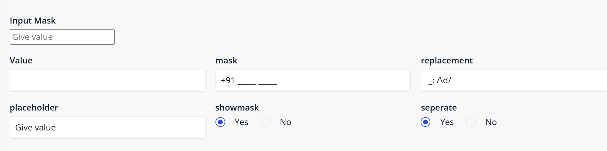
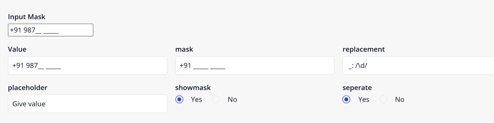
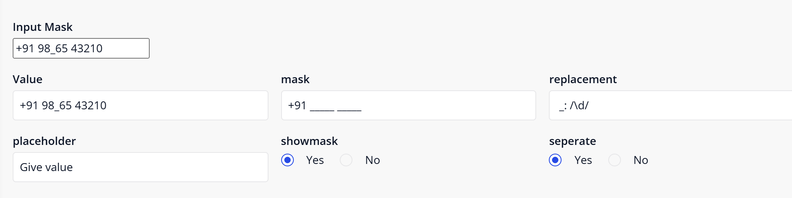
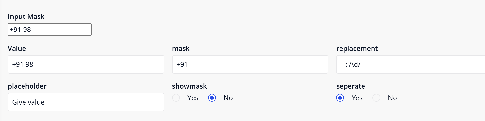
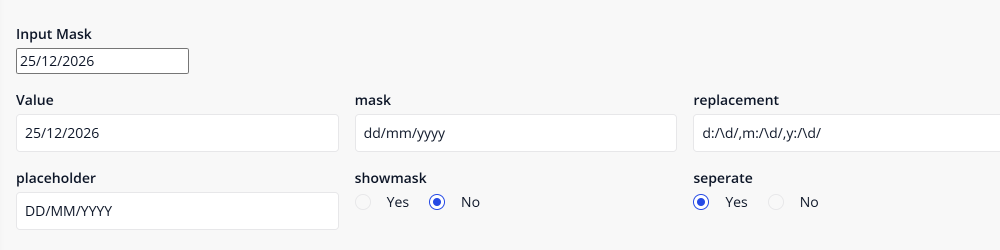
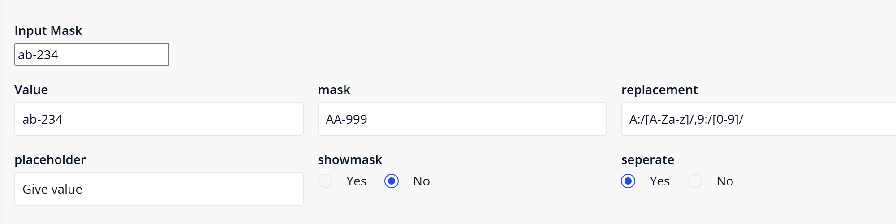

# Input Mask

This widget provides a flexible and reusable input field with masking capabilities, enabling controlled user input formats such as phone numbers, dates, IDs, and custom patterns in Mendix.


## Documentation

- [Input Mask 10.24.17.docx](docs/Input%20Mask%2010.24.17.docx): install, upgrade, configuration, mask and replacement rules, properties, show mask and separate, styling and limitations.
- [Marketplace documentation](docs/Marketplace%20Documentation%20-%20Input%20Mask.md): the same in short form.

## Version 1.1.0 for Mendix Studio Pro 10.24.17

Input Mask 1.1.0 is rebuilt for **Mendix Studio Pro 10.24.17** and the Mendix React client.

### Download

- Download `mendix.InputMask.mpk` from the release [Version1.1.0](https://github.com/bharathidas/InputMask/releases/tag/Version1.1.0) or from the root of this repository.
- Copy it into the `widgets` folder of your app and press **F4** (App > Synchronize App Directory) in Studio Pro.
- The previous package is in release [Version1.0.0](https://github.com/bharathidas/InputMask/releases/tag/Version1.0.0).

### Changes in 1.1.0

- Built with `@mendix/pluggable-widgets-tools` 10.16.0 for Studio Pro 10.24.17 and React 18, as a production build. The package is about 20 KB (1.0.0: about 131 KB).
- The input can be cleared. In 1.0.0 an empty value was refused by a built-in "Value is required" rule without any message, so the attribute kept its old value.
- A regular expression may contain commas and colons, for example `/[a,b:]/` or `/\d{1,2}/`. In 1.0.0 the rule was cut at the comma, and the widget could disappear from the page with an error.
- An invalid regular expression no longer breaks the widget. The rule is skipped; the other rules still work.
- The On click action runs when the user clicks the input. In 1.0.0 it never ran.
- A read-only value attribute gives a disabled input. In 1.0.0 the input stayed editable and typing caused an error. The input is also disabled while the attribute is loading.
- The validation message of the value attribute is shown below the input. In 1.0.0 it was not shown.
- The label is linked to the input, and the tab index from Studio Pro is applied.
- Studio Pro design mode shows a simple box with the name of the value attribute. In 1.0.0 it showed a real input filled with the attribute name.
- New CSS classes `widget-inputmask` and `widget-inputmask-input`. The look of the input is unchanged.
- Clearer property descriptions. The property keys are the same as in 1.0.0, so existing pages keep their settings.

Tested with 42 checks: 29 in a Mendix 10.24.17 app (masks, rules, show mask, separate, placeholder, clearing, values set outside the widget) and 13 on the widget code outside Mendix with simulated Mendix values (read-only, loading, On click, validation message, design-mode preview).

### Upgrading from 1.0.0

1. Replace `mendix.InputMask.mpk` in the `widgets` folder of your app with the 1.1.0 file.
2. Press **F4** (Synchronize App Directory).
3. Studio Pro reports that the widget definition has changed. Right-click the error and choose **Update all widgets**. Your settings are kept.
4. If the running app still shows the old widget, stop it, choose **App > Clean Deployment Directory** and run it again.

Check after upgrading: the value attribute can now become empty when the user clears the input. If the value is mandatory, add your own check (a validation rule on the entity or a check in the save microflow). An On click action that was configured but never ran in 1.0.0 now runs.

### Mask and replacement

| Use | Mask | Replacement | Typed | Result |
| --- | --- | --- | --- | --- |
| Phone number | `+91 _____ _____` | `_:/\d/` | 9876543210 | +91 98765 43210 |
| Date | `dd/mm/yyyy` | `d:/\d/,m:/\d/,y:/\d/` | 25122026 | 25/12/2026 |
| Letters and digits | `AA-999` | `A:/[A-Za-z]/,9:/[0-9]/` | 1ab2345 | ab-234 |

The value is stored exactly as shown in the input, including the fixed mask characters.

### Source code and build

The widget source is in the [`inputMask`](inputMask) folder.

```
cd inputMask
npm install
npm run release
```

The package is created in `inputMask/dist/1.1.0/mendix.InputMask.mpk`. Node.js 16 or later is required.

---

## Features:
### •	Mask - 
Defines the mask pattern.
### •	Replacement -
Defines regex rules for mask characters (passed as string).
### •	ShowMask -
Enables/disables mask visibility.
### •	SeparateKey -
Enables separation of mask and input.
### •	Placeholder -
Sets placeholder text.

###  Demo URL: 
https://inputmask-sandbox.mxapps.io/index.html?profile=Responsive

## Dependencies:

Mendix Studio Pro 10.24.17 (widget 1.1.0). Widget 1.0.0: Mendix Modeler 10.24.6 or newer.

## Issues, Suggestions & Feature Requests:
https://github.com/bharathidas/InputMask/issues

## Screenshots (version 1.1.0, Mendix 10.24.17):

The text boxes below the widget show the attributes that the widget uses.









## Screenshots (version 1.0.0):


